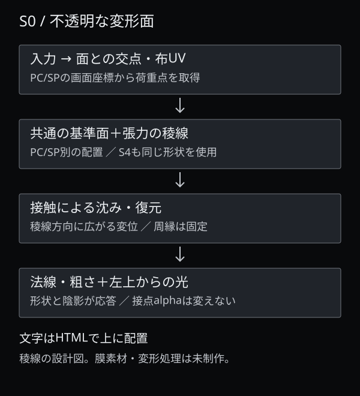
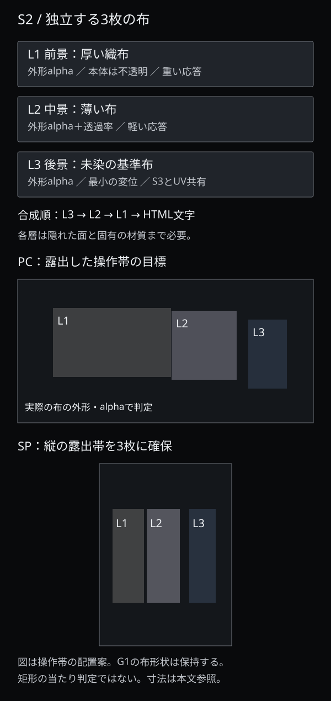
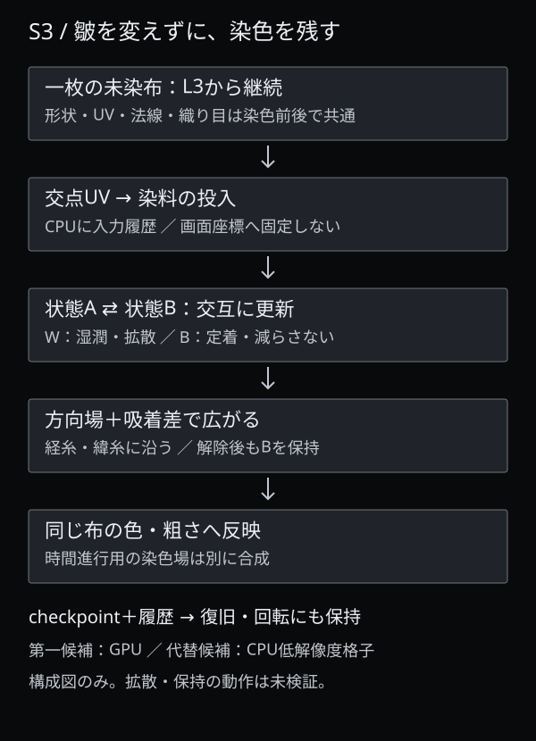

# AWAI G1.5 — 実装と美術をつなぐ設計

2026-10-09。G1の美術コンセプト・色・光・基本構図は本人承認済み。本書はG2前の設計案で、性能や操作の実証結果ではない。既存G1画像・公開本編は変更せず、インタラクションは実装しない。

確認資料：[G1の承認構図](https://karisyacho.github.io/awai-g1-20261008/g1-keyframes/)／[本書のスマホ閲覧版](https://github.com/karisyacho/karisyacho.github.io/blob/main/awai-g15-20261009/04-implementation-art-plan.md)。

## 1. 共通の設計判断

G1の完成合成画像は照明・配置・質感の基準として保存する。合成画像だけを引き伸ばしたり透過したりして操作を成立させない。必要な面を再構成し、静止状態を承認構図へ合わせる。再構成部分は各場面の材質と形状に限定し、全10構図の再生成は行わない。

| 場面 | 第一候補の描画構造 | 触れた結果 | 基準として残すもの |
|---|---|---|---|
| S0 | 張力のある面メッシュ＋基準稜線＋微細な法線・粗さ | 接点周辺の沈みと、稜線に沿う歪み・陰影の移動 | G1の斜め稜線、黒の面積、左上の光 |
| S2 | 個別の形状・UV・透過率を持つ3面 | 一枚の位置・張りが変わり、奥の布が見える。解除後に復元 | PCの斜め／縦の重なり、SPの縦方向の3面 |
| S3 | 一枚の未染布メッシュ＋UV上の染料状態 | 繊維方向へ染まり、操作終了後も染色が残る | 皺と織り目、未染の暗い灰、藍の方向 |

将来の本編は一つの描画コンテキストを共有し、必要な場面と隣接場面だけを保持する候補とする。今回その統合を行わない。文字と相談導線はHTMLに残す。

## 2. S0 — 黒い膜を変形可能な面へ

**基準形状。** PC/SPそれぞれのG1画像から稜線の位置・幅・高さの関係を手で採寸し、低周波の高さ場または制御点のある面へ置き換える。画像から正しい立体が自動復元できるとは扱わない。微細な凹凸は別の法線・粗さ素材に分離し、生成画像に焼き込まれた光を色テクスチャへ重ねない。

**変形。** 基準形状に、接点の圧力と復元量を加える。接点からの影響は縦横で同じ半径にせず、稜線に沿う方向と横断方向で広がりを変える。周縁の固定帯へ向けて変位を減衰させ、面の張力を保つ。沈みだけでなく稜線の位置と法線が変わり、同じ左上光源の反射・陰影が応答する。最大沈みは画面短辺の0.5〜1.5%相当を初期比較範囲とし、承認値ではない。

**入力と形状の対応。** 画面座標から実際の面との交点を求め、そのUVを荷重点にする。文字と端末の端を除く面全体を基本操作域とする。描画面が移動しても、荷重点が画面の見かけだけに貼り付かないようにする。指圧は端末依存のため必須にせず、押下時間と移動から応答量を作る。

**奥の世界の予感。** タッチでは膜の不透明性を維持する。沈みとともに側方の弱い琥珀反射がわずかに現れる案とする。裏世界そのものの開示はS0→S1の場面転換で行う。接点を透明にする円形穴、透過マスク、破れ、端をめくる構造は用いない。

**S4との共有。** 稜線の制御点と固定帯の定義をS4の紙面にも使う。材質だけを白いセルロースへ変え、S4では同じ荷重に対する反応を極小にする。S0/S4を別々の写真変形で似せるより、面の同一性を説明できる。白紙の起伏量はG1画像を上限の見本として比較し、変更が必要なら該当面だけを確認する。

既存 `site-awai-v3/paper-prototype/lib/washi.ts` は紙の密度・透過等の参考であり、この変形面を備えていない。`OpeningScene.tsx` の入力解除・資源解放は参考にできるが、膜の形状と法線更新は新規設計が必要。

## 3. S2 — KASANEの3枚を分離する

### 素材の単位と合成

| 布 | 独立して必要なデータ | 動かす範囲と見せ方 |
|---|---|---|
| L1 前景・厚い織布 | 全形状、色／織り目、外形alpha、法線／粗さ、固定帯 | 重さを残した小さな横ずれと沈み。布本体はほぼ不透明、外形外だけ透明 |
| L2 中景・薄い布 | 全形状、織り目、外形alpha、透過率、法線／粗さ、固定帯 | L1より軽くずれ、重なった部分の暗さが変わる。透けるが発光しない |
| L3 後景・基準布 | 全形状、未染の色／織り目、外形alpha、法線／粗さ、固定帯 | 最小の変位。S3へ渡す同一の基準布とUVを持つ |

透明素材とは3枚すべてを半透明にする意味ではない。L1/L3は布本体を保ち、背景だけ透過。L2の透過率を別に制御する。PNG/WebPのRGBAは確認用の切り抜きに使えるが、最終的な照明・皺・陰影は各面のデータで描く。

G1画像から見える部分を切り抜くだけでは、ずれた後の隠れていた布が欠ける。許可された変位の最大範囲＋余裕を含む完全な3面が必要。目安は画面短辺の変位2〜4%とし、その2倍以上の余白を重なり側へ確保する。画像に焼き込まれた他の布の影や琥珀光を分離素材へ残さない。

共通照明下で後→中→前の順に合成し、前後関係を固定する。接触では重なり面積を変えるが、布同士が突き抜けたり順序を交換したりしない。布自身の陰影と、他の布へ落ちる弱い影を区別する。L2の裏に黒い縁が出ないよう、alphaの扱い・輪郭余白・縮小表示をG2で確認する。

### PC/SPの操作領域

下表は**画面上の配置目標**。左上を(0,0)、右下を(1,1)とする。矩形全体を当たり判定にせず、実際の布形状の交点とalpha、露出部分で判定する。図の帯は候補域で、確定素材から再採寸する。

| 布 | PCの候補域 x / y | SPの候補域 x / y | 誘導と競合 |
|---|---|---|---|
| L1 | .12–.52 / .20–.68 | .10–.34 / .24–.76 | 左の厚い面。下部のKASANE文字を避ける |
| L2 | .52–.74 / .22–.70 | .36–.61 / .24–.76 | 中央の透ける露出帯。前景が覆う箇所はL1を優先 |
| L3 | .78–.91 / .28–.76 | .68–.88 / .27–.75 | 右の後景露出帯。SP右上の文字を避ける |

スマホ各布に44×44 CSS px以上の露出操作域を確保する設計目標を置く。320px幅で確保できなければ布の間隔を局所調整し、透明な前景を通して奥を恣意的に選ぶ処理で埋め合わせない。押下時に一枚を選択して解除まで保持し、ドラッグ中に対象を乗り換えない。透けるL2も布として選び、奥のL3には露出帯から触れる。

PCは押下・ドラッグ、カーソルの接近はごく小さな予備応答。SPは静止タッチまたは横移動を介入、縦移動を時間進行へ譲る。`touch-action: pan-y pinch-zoom`を候補とし、縦スクロールによる`pointercancel`を正常な解除として扱う。全画面のスクロールや拡大を禁止しない。閾値と復元時間はG2の実機確認で決める。[入力の仕様](https://developer.mozilla.org/en-US/docs/Web/CSS/Reference/Properties/touch-action)

`site-kasane/gl.js` は上辺固定の一枚布で、3枚の形状・透過・選択・相互の影は未実装。布目・変位・destroyの考え方だけを参照し、写真切替のKASANEは継承しない。

## 4. S3 — 一枚の布と、残る染色

### 皺を一致させる前提

未染のL3布を唯一の基準とし、形状・UV・法線・織り目・照明を染色の前後で共有する。染色は基準布の色と必要最小限の粗さを変えるだけで、別の染色後写真へ切り替えない。G1のS3画像は藍の量と配置を参照する。既存の染色前後画像は色の参考に留め、対応が取れない皺を混合しない。

UVは画面ではなく布に付く。画面から変形した布へ交点を求めて染点を置く。PC/SPは同じ布UVの見せ方を変えるので、回転・リサイズ時にも染みが布と一緒に残る。繊維方向も画像の縦横ではなく、そのUVの経糸・緯糸に定義する。

### 方式の比較

| 方式 | 繊維への沿い方・保持 | 長所 | 制約・採否 |
|---|---|---|---|
| A：GPUで湿潤・定着量を更新 | UV上の方向場に沿う異方性拡散。状態テクスチャへ定着量を蓄積 | 連続的な広がり、複数染点の合流、布に追従 | 計算負荷・数値安定性・context loss対応が必要。**第一候補** |
| B：CPUの低解像度格子 | 同じ方向場で差分更新し、保持した格子を描画側へ転送 | 状態をCPUに残せる。GPU拡張への依存を減らせる | 更新・転送が負荷になりやすい。方向に沿う広がりを粗くし、低性能端末の**操作可能な代替候補** |
| C：繊維方向のブラシを順次蓄積 | 細長い不均一な筆跡をUVマスクへ加算。蓄積は残る | 安価で静止美術へ合わせやすい | 液体の移動・合流ではなく見かけの成長。A/Bが成立しない場合に**簡略版として再承認**。円形stampをそのまま出さない |

### 第一候補Aの状態設計

二枚の状態テクスチャを交互に読み書きし、同じテクスチャを一つの描画処理で同時に読み書きしない。湿潤量Wと定着量Bを別チャンネルに置く。染料の移動は経糸・緯糸の拡散係数を変え、繊維の凹凸で浸透速度を揺らす。固定刻みで更新し、経過時間が長いフレームで無制限に計算を追いつかせない。

指を離すと投入だけが止まり、残ったWが短時間拡散・吸着する。Bは減らさず0〜1へ制限し、Wが減っても色は戻らない。再訪時も同じ体験内ではBを保持する。これは布への浸透を表す演出モデルであり、実際の染色化学の再現とは主張しない。

繊維方向の速度比は2〜4倍程度を初期比較案とするが、全染点が同じ楕円に見えないよう方向場・吸着差を組み合わせる。既存の`site-aima/cloth.js:54–76,227–235`の12点・円距離＋noise方式は、この蓄積状態には流用しない。

RGBA8を基本候補として量子化・階調の評価を行う。浮動小数点render targetは拡張対応とframebuffer完全性を確認できた端末だけで使い、必須条件にしない。[浮動小数点拡張の仕様](https://developer.mozilla.org/en-US/docs/Web/API/EXT_color_buffer_float)

初期予算はSP512²、PC1024²の状態格子。RGBA8の二枚だけならそれぞれ2MiB／8MiB、RGBA16Fなら4MiB／16MiB。これは計算値で、布テクスチャ・深度・画面buffer・checkpointは別。画像の圧縮ファイル容量をGPUメモリと混同しない。8bitで染色が階段状になる場合は更新式・dithering・方式B等を比較し、floatへの切替だけで解決済みとしない。

### 保持と物語の合流

- 染点UV・投入量・投入時刻をCPU側に記録し、湿潤・定着の両状態のcheckpointと差分履歴で再構築できる設計にする。GPUだけに状態を置かない。context loss／復旧はG2の必須検証。
- 回転やリサイズでは布UVを保持し、画面解像度の変更で染色格子を初期化しない。
- 保持対象は本編の一回の体験と場面の往復。再読込・端末間の永久保存は今回の要求に含めず、別途決める。
- 操作なしでも藍の世界へ到達するため、時間進行用の染色場と利用者の定着場は別に持ち、表示時に合成する。利用者の染みを消して共通終端へ寄せない。終端は同じ藍の色調・面の位置に合流し、染みの細部は個別に残せる。
- 非対応環境は同じ布形状の静止キーフレームへ戻す。動かない代替を「操作可能」と表示しない。

## 5. 四つの場面転換と素材の整合

各転換では接触を新規受付せず、選択中の布を解除する。スクロール進度が転換の主軸で、操作の有無を通過条件にしない。以下は接続の設計で、タイムライン実装ではない。

| 接続 | 採用する構造と接続方法 | 守ること |
|---|---|---|
| S0→S1 | 不透明な膜の稜線を近接視点で追い、暗い面が画面を占める位置で焙煎金属の斜め反射へカット。S1は独立した焙煎plate | タッチ穴から写真を覗かせない。膜が豆へモーフィングする前提も置かない |
| S1→S2 | 手前を横切るL1布の面で焙煎plateを覆い、左上光の反射を布へ引き継ぐ。蒸気はS1内で収束 | 遮蔽は布の実際の外形・移動によるもの。全画面フェードの繰り返しにしない |
| S2→S3 | L1/L2が画面外へ静かに移り、同じL3布へカメラを寄せる。L3の未染色・皺・UVを維持して藍の投入を始める | L3を別の皺の写真へ交換しない。見える範囲外のL3も完全な面として必要 |
| S3→S4 | 染色済み布を奥へ退かせ、S0と共通形状の境界面で遮蔽。画面が暗い面になる節目から同じ面の白い材質を見せる | 染色状態を消して布を白に戻さない。白は別の境界面の終幕。境界面は破らず・めくらず、面として移動する |

転換中の材質交換は遮蔽・カットの節目に限定する。途中で触れた布が途中状態のまま残る場合も、各場面の終端構図へ復元して接続する。S3の染色だけは復元対象から除外する。

## 6. 実画面比率と入力の配置

G1の背景は約7:4／4:7であり、16:9や390×844の全画面素材が完成したことにはならない。以降の面構成は背景画像のcoverではなく、PC/SPそれぞれのカメラ・面配置・文字余白で画面を埋める。

| 確認画面（CSS px） | 対応方針 |
|---|---|
| PC 1440×900、1920×1080 | 稜線と布の構図をPC設定で保持。上下の差は黒い空間と面の画角で調整 |
| PC 1366×768、超横長2560×1080 | 被写体を無制限に拡大しない。左右の黒い空間を増やし、文字・操作帯を画面内に置く |
| SP 390×844、360×800、320×568 | 縦用の面配置。下端の文字と44px操作域を同時に確保。小画面で文字を画像と一緒に縮小しない |
| 横向き844×390、タブレット768×1024 | 横向きはPCの近接構図を専用調整。中間比率は縦用を基準に面間隔を調整。染色UVは共通 |

基準枠は安定した`svh`を候補とし、ブラウザバーの伸縮で布や操作点が飛ばないようにする。safe-areaを文字・接触域から除外し、バー表示／非表示、回転後の両方をG2で確認する。[viewport単位の仕様](https://developer.mozilla.org/en-US/docs/Web/CSS/Reference/Values/length)

短辺に対する面の位置、UV、画面内の文字位置を分けて管理する。画像上の比率をそのままCSS画面比率へ流用しない。G1の文字サイズを基準に、可読サイズの下限と端末差を確認する。

## 7. 黒階調・負荷・素材条件

**黒の視認性。** 承認済みの基底`#090A0C`と面の明部`#28292D`を維持し、輪郭・皺の識別に必要な局所階調を守る。sRGBの画像と材質の照明計算の変換を統一し、二重のgamma補正で黒を潰さない。S0の稜線、S2の3面、S3の藍と未染の境界を、物理iPhone／Androidの通常・低輝度、室内／明るい場所で比較する。環境照度を推定して勝手に色を変えず、必要ならユーザーが選べる視認性設定をG3で検討する。G1のブラウザ画面確認は実機合格の代わりにしない。

**負荷。** SPは画面DPR1〜1.5程度を初期候補にし、染色状態の解像度と画面描画の解像度を分ける。重ねる透過布は3枚に制限し、画面外の処理を止める。各案は30fps以上を初期目標として実機で測るが、保証値ではない。低性能端末で処理を下げても布の色・UV・染色結果は保持する。WebGLの拡張・上限を実行環境で確認し、資源を明示解放する。[WebGLの推奨事項](https://developer.mozilla.org/en-US/docs/Web/API/WebGL_API/WebGL_best_practices)

**利用条件。** G1の生成画像は承認済みの美術方向の見本であり、本番採用の権利確認完了とは別。既存の助任動画・Mixkit蒸気・対応不明のKASANE派生・生成AIMA素材は未確認のまま本番へ入れない。G0で原写真と一般条件を確認したKASANE元素材も、使用する派生ファイルまで出典が追えることを再確認する。代替は自前の手続き的材質、許諾記録のある写真／撮影素材を優先する。Webフォントは配信・改変・再配布条件を確認するまで端末搭載書体を維持。

素材単位で、出典URL、取得日、条件の記録、加工許可、作者／権利者、派生元、公開用途、採否を台帳へ残す。確認が取れない素材は仮素材のまま停止し、「無料だから商用可」と推定しない。

## 8. 不足素材一覧とG2に渡す条件

下記ファイル名は**制作予定の識別名**で、まだ存在しない。素材の制作・調達は今回行っていない。

| 予定名・単位 | 必要な内容／理由 | 完了の見分け方 |
|---|---|---|
| `boundary-shape-pc/sp` | S0/S4共通の稜線・高さ・固定帯。G1画像だけでは荷重に対する変形を定義できない | 触れていない面をPC/SPの承認構図へ重ねて比較できる |
| `membrane-material`／`paper-material` | 照明を焼き込まない色・法線・粗さ。膜の凹凸と紙繊維を分ける | 共通面と共通光源で材質差が出る。皮革に固定されない |
| `kasane-L1/L2/L3` 各全形状＋材質 | 隠れた部分を含む3面、alpha、法線、粗さ、L2透過率、固定帯 | 最大変位でも欠損・黒縁・焼き込み影がなく、3枚を単独表示できる |
| `kasane-layout-pc/sp` | カメラ・布の配置・露出操作域の定義 | G1を保持し、小画面でも各布に44px目標の露出域がある |
| `aima-base-cloth` | L3と共有する唯一の未染布、UV、織り目、法線 | 染色量0／中間／最大で皺の位置が一致する |
| `aima-fiber-field`／`absorption` | 経緯方向と浸透・定着の差。写真だけでは方向を持つ計算にならない | 拡散が画面の縦横ではなく布目に沿う |
| `aima-indigo-material`／`auto-dye-guide` | 藍色と粗さの基準、操作なしの物語進行用分布 | G1の藍の位置・深さへ到達し、操作の染みを消さない |
| `suketo-plate-pc/sp`＋必要なら蒸気 | 実素材または仮素材の独立焙煎面。出典・許諾と店舗の実在性を分ける | 使うファイルまで権利記録がある。未確認時は架空見本の表示を維持 |
| `fallback-pc/sp`・検証シート | 同一構図の静止代替、画面比率・黒階調・素材対応表 | 非対応でも5場面を読める。合格を実機記録と結び付ける |

G2の確認項目は、S0の沈みと稜線の連動、S2三枚の選択・復元・欠損なし、S3繊維拡散・12点超の保持・回転とcontext loss復旧、入力と縦scrollの両立、PC/SPの静止一致と黒の識別。まず各独立プロトタイプで検証し、実現が難しいと判明した場合は該当する方式と美術への影響をG3へ戻す。

本書と図・不足素材の設計を本人が確認するまで、G2の実装を開始しない。
